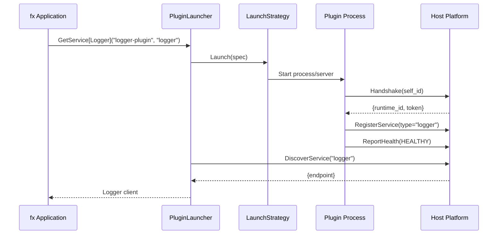

# PluginLauncher Design: Pluggable Strategies for fx Integration

**Status:** Approved
**Date:** 2026-01-26
**Task:** KOR-dxjx, KOR-thjs

## Overview

PluginLauncher enables uber/fx dependency injection with connect-plugin-go, supporting both process-based and in-memory plugin deployment through pluggable strategies.

## Goals

1. **fx DI Integration:** Provide plugin clients as fx-injectable types
2. **Pluggable Strategies:** Support process-based, in-memory, and future strategies
3. **Multi-Service Plugins:** Handle plugins that provide multiple services
4. **Unmanaged Deployment:** Plugins self-register (fx is the orchestrator)
5. **Clean Abstraction:** Hide process/server management from fx Provide functions

## Architecture

```
fx Application
    ↓ needs Logger
PluginLauncher.GetService[Logger]("logger-plugin", "logger")
    ↓ uses
LaunchStrategy.Launch(spec) → endpoint
    ↓
Plugin Process/Server started
    ↓ self-registers
Host Platform ServiceRegistry
    ↓ discovers
Returns Logger client to fx
```

## Core Interfaces

### LaunchStrategy

```go
// LaunchStrategy defines how plugins are instantiated and started.
// Implementations: ProcessStrategy, InMemoryStrategy, RemoteStrategy (future).
type LaunchStrategy interface {
    // Launch starts a plugin and returns its endpoint URL.
    // Returns:
    //   - endpoint: URL where plugin is listening (e.g., "http://localhost:8081")
    //   - cleanup: Function to stop/cleanup the plugin
    //   - error: If launch failed
    Launch(ctx context.Context, spec PluginSpec) (endpoint string, cleanup func(), error)

    // Name returns the strategy name (e.g., "process", "in-memory")
    Name() string
}
```

### PluginSpec

```go
// PluginSpec describes a plugin and how to launch it.
type PluginSpec struct {
    // Name is the plugin identifier (e.g., "logger-plugin", "data-plugin")
    Name string

    // Provides lists all service types this plugin provides (can be multiple!)
    // Example: ["cache", "storage"] for a data-plugin
    Provides []string

    // Strategy specifies which LaunchStrategy to use
    // Must match a registered strategy name
    Strategy string

    // Port is the port the plugin will listen on
    Port int

    // === Process Strategy Fields ===

    // BinaryPath is the path to the plugin binary
    // Used by ProcessStrategy
    BinaryPath string

    // === In-Memory Strategy Fields ===

    // Plugin is the plugin wrapper (e.g., &kvplugin.KVServicePlugin{})
    // Used by InMemoryStrategy
    Plugin connectplugin.Plugin

    // ImplFactory creates the plugin implementation
    // Used by InMemoryStrategy
    // Returns the handler (e.g., &LoggerImpl{}, &CacheImpl{})
    ImplFactory func() any

    // === Metadata ===

    // Metadata contains additional plugin metadata (optional)
    // Can include: version, description, etc.
    Metadata map[string]string
}
```

### PluginLauncher

```go
// PluginLauncher manages plugin lifecycle using pluggable strategies.
type PluginLauncher struct {
    platform   *Platform
    strategies map[string]LaunchStrategy  // "process" → ProcessStrategy
    specs      map[string]PluginSpec      // "logger-plugin" → spec
    instances  map[string]*pluginInstance // Track launched plugins
    mu         sync.Mutex
}

type pluginInstance struct {
    pluginName string
    endpoint   string
    cleanup    func()
    provides   []string  // Services this instance provides
}

// NewPluginLauncher creates a launcher.
func NewPluginLauncher(platform *Platform) *PluginLauncher {
    return &PluginLauncher{
        platform:   platform,
        strategies: make(map[string]LaunchStrategy),
        specs:      make(map[string]PluginSpec),
        instances:  make(map[string]*pluginInstance),
    }
}

// RegisterStrategy registers a launch strategy.
func (l *PluginLauncher) RegisterStrategy(strategy LaunchStrategy) {
    l.mu.Lock()
    defer l.mu.Unlock()
    l.strategies[strategy.Name()] = strategy
}

// Configure adds plugin specs.
func (l *PluginLauncher) Configure(specs map[string]PluginSpec) {
    l.mu.Lock()
    defer l.mu.Unlock()
    for name, spec := range specs {
        l.specs[name] = spec
    }
}

// GetService returns a client for a specific service type from a plugin.
// If the plugin isn't running, launches it first.
// If the plugin is already running, just discovers the service.
func (l *PluginLauncher) GetService[T any](pluginName, serviceType string) (T, error) {
    var zero T

    l.mu.Lock()
    defer l.mu.Unlock()

    // 1. Validate plugin is configured
    spec, ok := l.specs[pluginName]
    if !ok {
        return zero, fmt.Errorf("plugin %q not configured", pluginName)
    }

    // 2. Validate plugin provides this service
    if !contains(spec.Provides, serviceType) {
        return zero, fmt.Errorf("plugin %q doesn't provide service %q (provides: %v)",
            pluginName, serviceType, spec.Provides)
    }

    // 3. Launch plugin if not already running
    instance, exists := l.instances[pluginName]
    if !exists {
        // Get strategy
        strategy, ok := l.strategies[spec.Strategy]
        if !ok {
            return zero, fmt.Errorf("strategy %q not registered", spec.Strategy)
        }

        // Launch plugin
        endpoint, cleanup, err := strategy.Launch(context.Background(), spec)
        if err != nil {
            return zero, fmt.Errorf("failed to launch plugin %q: %w", pluginName, err)
        }

        // Store instance
        instance = &pluginInstance{
            pluginName: pluginName,
            endpoint:   endpoint,
            cleanup:    cleanup,
            provides:   spec.Provides,
        }
        l.instances[pluginName] = instance
    }

    // 4. Discover specific service from registry
    // Plugin already registered its services (process started and self-registered)
    endpoint, err := l.platform.Registry.DiscoverService(serviceType, "")
    if err != nil {
        return zero, fmt.Errorf("service %q not found in registry: %w", serviceType, err)
    }

    // 5. Create typed client
    // TODO: Need generic client factory - for now, caller must type-assert
    return l.createClient[T](endpoint)
}

// GetDefaultService is a convenience for single-service plugins.
func (l *PluginLauncher) GetDefaultService[T any](pluginName string) (T, error) {
    spec := l.specs[pluginName]
    if len(spec.Provides) != 1 {
        return zero, fmt.Errorf("plugin %q provides %d services, specify which",
            pluginName, len(spec.Provides))
    }
    return l.GetService[T](pluginName, spec.Provides[0])
}

// Shutdown stops all launched plugins.
func (l *PluginLauncher) Shutdown() {
    l.mu.Lock()
    defer l.mu.Unlock()

    for _, instance := range l.instances {
        if instance.cleanup != nil {
            instance.cleanup()
        }
    }
}
```

## ProcessStrategy Implementation

```go
// ProcessStrategy launches plugins as child processes.
type ProcessStrategy struct {
    mu        sync.Mutex
    processes map[string]*exec.Cmd  // pluginName → process
}

func (s *ProcessStrategy) Name() string {
    return "process"
}

func (s *ProcessStrategy) Launch(ctx context.Context, spec PluginSpec) (string, func(), error) {
    // 1. Start plugin binary as child process
    cmd := exec.CommandContext(ctx, spec.BinaryPath)
    cmd.Env = append(os.Environ(),
        fmt.Sprintf("PORT=%d", spec.Port),
        "HOST_URL=http://localhost:8080",  // Unmanaged: plugin connects to host
    )
    cmd.Stdout = os.Stdout
    cmd.Stderr = os.Stderr

    if err := cmd.Start(); err != nil {
        return "", nil, fmt.Errorf("failed to start process: %w", err)
    }

    s.mu.Lock()
    s.processes[spec.Name] = cmd
    s.mu.Unlock()

    // 2. Wait for plugin to be ready (listening on port)
    endpoint := fmt.Sprintf("http://localhost:%d", spec.Port)
    if err := waitForReady(endpoint, 5*time.Second); err != nil {
        cmd.Process.Kill()
        return "", nil, fmt.Errorf("plugin didn't become ready: %w", err)
    }

    // 3. Return endpoint and cleanup function
    cleanup := func() {
        s.mu.Lock()
        defer s.mu.Unlock()

        cmd.Process.Signal(os.Interrupt)
        time.Sleep(100 * time.Millisecond)
        cmd.Process.Kill()
        cmd.Wait()
        delete(s.processes, spec.Name)
    }

    return endpoint, cleanup, nil
}
```

## InMemoryStrategy Implementation

```go
// InMemoryStrategy runs plugins as in-process HTTP servers (goroutines).
type InMemoryStrategy struct {
    mu      sync.Mutex
    servers map[string]*http.Server  // pluginName → server
}

func (s *InMemoryStrategy) Name() string {
    return "in-memory"
}

func (s *InMemoryStrategy) Launch(ctx context.Context, spec PluginSpec) (string, func(), error) {
    // 1. Create implementation from factory
    impl := spec.ImplFactory()

    // 2. Create Connect handler from plugin
    path, handler, err := spec.Plugin.ConnectServer(impl)
    if err != nil {
        return "", nil, fmt.Errorf("failed to create handler: %w", err)
    }

    // 3. Create HTTP server
    mux := http.NewServeMux()
    mux.Handle(path, handler)

    // Add PluginIdentity service (for managed deployment compatibility)
    // TODO: Implement PluginIdentity handler for in-memory plugins

    server := &http.Server{
        Addr:    fmt.Sprintf("localhost:%d", spec.Port),
        Handler: mux,
    }

    // 4. Start server in goroutine
    go func() {
        if err := server.ListenAndServe(); err != http.ErrServerClosed {
            log.Printf("In-memory plugin %s error: %v", spec.Name, err)
        }
    }()

    // Wait for server to be ready
    endpoint := fmt.Sprintf("http://localhost:%d", spec.Port)
    if err := waitForReady(endpoint, 2*time.Second); err != nil {
        server.Shutdown(context.Background())
        return "", nil, fmt.Errorf("server didn't become ready: %w", err)
    }

    s.mu.Lock()
    s.servers[spec.Name] = server
    s.mu.Unlock()

    // 5. Return endpoint and cleanup
    cleanup := func() {
        s.mu.Lock()
        defer s.mu.Unlock()

        server.Shutdown(context.Background())
        delete(s.servers, spec.Name)
    }

    return endpoint, cleanup, nil
}
```

## fx Integration Pattern

### Example Application

```go
package main

import (
    "context"
    "log"

    connectplugin "github.com/masegraye/connect-plugin-go"
    "go.uber.org/fx"
)

func main() {
    app := fx.New(
        // === Infrastructure ===

        // Provide host platform (Service Registry)
        fx.Provide(NewPlatform),

        // Provide plugin launcher with strategies
        fx.Provide(func(platform *connectplugin.Platform) *connectplugin.PluginLauncher {
            launcher := connectplugin.NewPluginLauncher(platform)

            // Register strategies
            launcher.RegisterStrategy(&connectplugin.ProcessStrategy{})
            launcher.RegisterStrategy(&connectplugin.InMemoryStrategy{})

            // Configure plugins
            launcher.Configure(map[string]connectplugin.PluginSpec{
                "logger-plugin": {
                    Name:       "logger-plugin",
                    Provides:   []string{"logger"},
                    Strategy:   "process",          // ← Process-based
                    BinaryPath: "./dist/logger-plugin",
                    Port:       8081,
                },
                "data-plugin": {
                    Name:       "data-plugin",
                    Provides:   []string{"cache", "storage"},  // ← Multiple services!
                    Strategy:   "in-memory",        // ← In-memory
                    Plugin:     &dataplugin.DataServicePlugin{},
                    ImplFactory: func() any { return &DataImpl{} },
                    Port:       8082,
                },
            })

            return launcher
        }),

        // === Plugin Clients ===

        // Provide Logger interface (from process-based logger-plugin)
        fx.Provide(func(launcher *connectplugin.PluginLauncher) (Logger, error) {
            return launcher.GetService[Logger]("logger-plugin", "logger")
            // fx calls this → launcher starts logger process → returns client
        }),

        // Provide Cache interface (from in-memory data-plugin)
        fx.Provide(func(launcher *connectplugin.PluginLauncher) (Cache, error) {
            return launcher.GetService[Cache]("data-plugin", "cache")
            // Launcher starts data-plugin in-memory → returns cache client
        }),

        // Provide Storage interface (from same in-memory data-plugin)
        fx.Provide(func(launcher *connectplugin.PluginLauncher) (Storage, error) {
            return launcher.GetService[Storage]("data-plugin", "storage")
            // Launcher sees data-plugin already running → just discovers storage
        }),

        // === Application ===

        // Use plugins (fx injects)
        fx.Invoke(func(logger Logger, cache Cache, storage Storage) error {
            logger.Log("App started")
            cache.Set("greeting", "hello")
            storage.Save("data", []byte("value"))
            return nil
        }),

        // === Lifecycle ===

        // Ensure platform server is running
        fx.Invoke(func(lc fx.Lifecycle, platform *connectplugin.Platform) {
            lc.Append(fx.Hook{
                OnStart: func(ctx context.Context) error {
                    go platform.Serve(":8080")
                    time.Sleep(200 * time.Millisecond)  // Wait for ready
                    return nil
                },
                OnStop: func(ctx context.Context) error {
                    return platform.Shutdown(ctx)
                },
            })
        }),

        // Cleanup plugins on shutdown
        fx.Invoke(func(lc fx.Lifecycle, launcher *connectplugin.PluginLauncher) {
            lc.Append(fx.Hook{
                OnStop: func(ctx context.Context) error {
                    launcher.Shutdown()
                    return nil
                },
            })
        }),
    )

    app.Run()
}
```

## Multi-Service Plugin Handling

### Configuration

```go
// Single plugin provides multiple services
specs := map[string]PluginSpec{
    "data-plugin": {
        Name:     "data-plugin",
        Provides: []string{"cache", "storage", "metrics"},  // ← 3 services!
        Strategy: "process",
        BinaryPath: "./dist/data-plugin",
        Port: 8082,
    },
}
```

### Usage

```go
// Each service from the same plugin
fx.Provide(func(launcher *PluginLauncher) (Cache, error) {
    return launcher.GetService[Cache]("data-plugin", "cache")
    // First call: launches data-plugin process
}),

fx.Provide(func(launcher *PluginLauncher) (Storage, error) {
    return launcher.GetService[Storage]("data-plugin", "storage")
    // Second call: plugin already running, just discovers storage
}),

fx.Provide(func(launcher *PluginLauncher) (Metrics, error) {
    return launcher.GetService[Metrics]("data-plugin", "metrics")
    // Third call: plugin already running, just discovers metrics
}),
```

### Launcher Logic

```go
func (l *PluginLauncher) GetService[T any](pluginName, serviceType string) (T, error) {
    // Check if plugin already launched
    instance, exists := l.instances[pluginName]

    if !exists {
        // Plugin not running → launch it (starts ONCE for ALL services)
        spec := l.specs[pluginName]
        strategy := l.strategies[spec.Strategy]

        endpoint, cleanup, _ := strategy.Launch(ctx, spec)

        // Wait for plugin to self-register ALL its services
        time.Sleep(500 * time.Millisecond)

        instance = &pluginInstance{
            pluginName: pluginName,
            endpoint:   endpoint,
            cleanup:    cleanup,
            provides:   spec.Provides,
        }
        l.instances[pluginName] = instance
    }

    // Discover specific service from registry
    endpoint := l.discoverFromRegistry(serviceType)

    // Return typed client
    return l.createClient[T](endpoint)
}
```

**Key:** Plugin launches ONCE, provides MULTIPLE services. Subsequent GetService calls for the same plugin just discover different services.

## Strategy Comparison

| Strategy | When to Use | Pros | Cons |
|----------|-------------|------|------|
| **Process** | Production, isolation needed | Process isolation, realistic | Slower startup, process overhead |
| **In-Memory** | Testing, single-binary apps | Fast, easy debugging | No isolation, same process |
| **Remote** (future) | Existing services | No process mgmt | Network dependency |

## Deployment Model

**This is an UNMANAGED deployment:**
- fx is the orchestrator (not the platform)
- Plugins self-register with host
- Platform doesn't manage lifecycle (Platform.AddPlugin NOT used)
- Strategies start plugins, plugins connect to host



## Configuration Options

### Option 1: Code-based (shown above)

```go
launcher.Configure(map[string]PluginSpec{...})
```

### Option 2: Config file (future)

```yaml
# plugins.yaml
plugins:
  logger-plugin:
    provides: [logger]
    strategy: process
    binary: ./dist/logger-plugin
    port: 8081

  data-plugin:
    provides: [cache, storage]
    strategy: in-memory
    port: 8082
```

### Option 3: Auto-discovery (future)

Scan `dist/` for plugin binaries, query their metadata.

## Edge Cases

### Plugin Fails to Start

```go
_, err := launcher.GetService[Logger]("logger-plugin", "logger")
// Strategy.Launch fails → error returned
// fx can't start → app won't run
```

**Mitigation:** Retry logic in strategy, or graceful degradation.

### Plugin Doesn't Register Service

```go
// Plugin starts but doesn't register "logger" service
_, err := launcher.GetService[Logger]("logger-plugin", "logger")
// DiscoverService fails → error returned
```

**Mitigation:** Timeout with clear error message.

### fx Shutdown Order

```go
// Order matters:
1. App stops (fx Invoke functions)
2. Launcher.Shutdown() stops plugins
3. Platform.Shutdown() stops host

// Achieved via fx.Hook ordering
```

## Implementation Tasks

- [ ] Create launcher.go with PluginLauncher
- [ ] Create launch_strategy.go with interface
- [ ] Create launch_process.go with ProcessStrategy
- [ ] Create launch_inmemory.go with InMemoryStrategy
- [ ] Create launcher_test.go with tests
- [ ] Create examples/fx-managed/main.go
- [ ] Create examples/fx-managed/README.md
- [ ] Update Taskfile.yml to build fx-managed
- [ ] Update docs with fx-managed guide

## Testing Strategy

**Unit tests:**
- Mock LaunchStrategy for testing launcher logic
- Test multi-service plugin handling
- Test strategy selection

**Integration test:**
- examples/fx-managed/main.go as executable test
- Verify logger starts (process)
- Verify cache starts (in-memory)
- Verify both work together

## Open Questions

1. **Client factory:** How to create typed clients generically? May need type-specific factories.
2. **In-memory PluginIdentity:** Should in-memory plugins implement PluginIdentity service?
3. **Error handling:** Retry if plugin fails to start?
4. **Metadata:** Should launcher call GetPluginInfo() to validate Provides matches spec?

## Success Criteria

- [ ] Can mix process and in-memory plugins in same fx app
- [ ] Single plugin can provide multiple services
- [ ] fx DI graph determines startup order
- [ ] Plugins self-register with host (unmanaged)
- [ ] Clean shutdown via fx lifecycle
- [ ] Working example with logger + cache
- [ ] Documentation explains architecture

---

**Ready to build this?** Any changes to the design?
