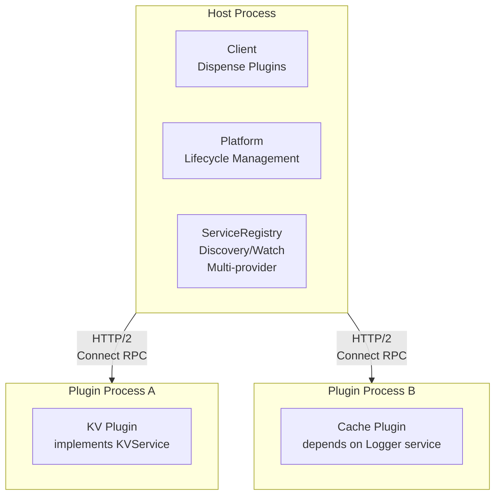

# Overview

## What is connect-plugin-go?

connect-plugin-go is a remote-first plugin system for Go applications. It enables you to build extensible applications where plugins run as separate processes and communicate over HTTP using [Connect RPC](https://connectrpc.com).

## Architecture



## Core Concepts

### Plugins

A **plugin** is a Go interface that provides specific functionality. Plugins are defined using Protocol Buffers and Connect RPC:

```protobuf
service KVService {
  rpc Get(GetRequest) returns (GetResponse);
  rpc Set(SetRequest) returns (SetResponse);
}
```

The code generator creates a type-safe Go interface from your proto definition.

### Host and Plugin Processes

- **Host**: The main application that uses plugins
- **Plugin**: A separate process that implements plugin interfaces
- Communication happens over HTTP/2 using Connect RPC
- Plugins can run locally, in containers, or on remote servers

### Handshake Protocol

Before any plugin communication, host and plugin perform a handshake to:

- Negotiate protocol versions
- Exchange magic cookies for basic validation
- Assign runtime identity 
- Declare service capabilities 

### Service Registry 

Plugins can provide and consume services from each other:

- **Service Provider**: Plugin that implements a service
- **Service Consumer**: Plugin that depends on a service
- **Host-Mediated Routing**: All plugin-to-plugin calls route through the host
- **Discovery**: Plugins discover services via the registry
- **Health Tracking**: Plugins report health, host routes accordingly

## Deployment Models

connect-plugin-go supports two deployment models:

### Managed: Platform-Managed Plugins

The host platform orchestrates plugin lifecycle:

```
1. Host starts plugin process
2. Host calls plugin's GetPluginInfo()
3. Host assigns runtime_id and token
4. Host calls plugin's SetRuntimeIdentity()
5. Plugin registers services with host
6. Plugin reports health to host
```

**Use case**: Traditional plugin architectures, local development, trusted plugins.

### Unmanaged: Self-Registering Plugins

External orchestrator (Kubernetes, docker-compose) manages plugins:

```
1. External system starts plugin
2. Plugin calls host's Handshake()
3. Host assigns runtime_id and token
4. Plugin registers services with host
5. Plugin reports health to host
```

**Use case**: Microservices, Kubernetes deployments, cloud-native architectures.

## Key Features

### Type Safety

Generated code ensures compile-time type safety:

```go
// Strongly typed - no interface{} casting needed
kvStore := connectplugin.MustDispenseTyped[KVStore](client, "kv")
value, err := kvStore.Get(ctx, "mykey")
```

### Health Checking

Three-state health model:

- **Healthy**: Fully functional, receives traffic
- **Degraded**: Functional with limitations, still receives traffic
- **Unhealthy**: Cannot serve requests, no traffic routed

Plugins decide their own degradation behavior when dependencies fail.

### Service Discovery

Plugins discover services from the registry:

```go
endpoint, err := registryClient.DiscoverService(ctx, &DiscoverServiceRequest{
    ServiceType: "logger",
    MinVersion:  "1.0.0",
})
```

Host selects provider using configurable strategies (First, RoundRobin, Random).

### Dependency Management

Declare dependencies in metadata:

```go
Metadata: PluginMetadata{
    Provides: []ServiceDeclaration{
        {Type: "cache", Version: "1.0.0"},
    },
    Requires: []ServiceDependency{
        {Type: "logger", RequiredForStartup: true},
    },
}
```

Host computes startup order using topological sort.

### Reliability Patterns

Built-in interceptors for production deployments:

- **Retry**: Exponential backoff, jitter, smart error detection
- **Circuit Breaker**: Fail fast when services are down
- **Auth**: Token-based, API keys, mTLS

### Dynamic Lifecycle

Add, remove, and replace plugins at runtime:

```go
// Add plugin dynamically
platform.AddPlugin(ctx, pluginConfig)

// Hot reload (blue-green deployment)
platform.ReplacePlugin(ctx, oldRuntimeID, newConfig)

// Analyze impact before removal
impact := platform.GetImpact(runtimeID)
```

## Architecture Principles

### Remote-First

All communication happens over network, even for local plugins. This enables:

- Deployment flexibility (local, containers, cloud)
- Process isolation and security
- Language interoperability (future)

### Cloud-Native

Plugins behave like cloud services:

- Self-healing via health reporting and recovery
- Graceful degradation when dependencies unavailable
- Watch-based notifications for dependency changes
- Autonomous decision-making (not host-controlled)

### Composable

Interceptors compose for cross-cutting concerns:

```go
// Layer interceptors: auth → circuit breaker → retry
interceptors := []connect.UnaryInterceptorFunc{
    auth.ClientInterceptor(),
    CircuitBreakerInterceptor(cb),
    RetryInterceptor(retryPolicy),
}
```

### Observable

Built-in observability hooks:

- Health state tracking and transitions
- Service registry events
- Circuit breaker state changes
- Plugin lifecycle events

## When to Use

**Good fit:**

- Building extensible applications with plugin ecosystems
- Multi-tenant systems with tenant-specific plugins
- Service mesh architectures with coordinated services
- Applications that need hot reload without downtime
- Systems requiring dependency management between components

**Not a fit:**

- Simple function callbacks (use regular Go interfaces)
- Performance-critical in-process plugins (use Go's plugin package)
- Single-binary deployments without extensibility needs

## Next Steps

- [Quick Start Guide](quickstart.md) - Get running in 5 minutes
- [Deployment Models](deployment-models.md) - Choose your deployment strategy
- [KV Example](../guides/kv-example.md) - Complete walkthrough
- [Service Registry Guide](../guides/service-registry.md) - Plugin-to-plugin communication
