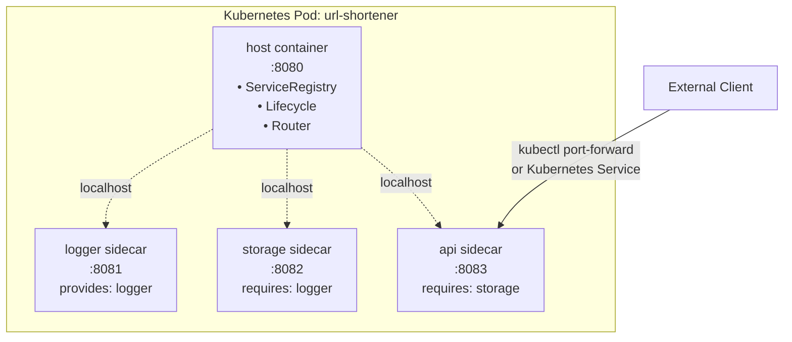

# Kubernetes Deployment Guide

Demonstrates **unmanaged deployment** with the Kubernetes sidecar pattern.

## Overview

This guide shows how to deploy connect-plugin-go plugins to Kubernetes using the **sidecar pattern**. All plugin containers run in a single pod and communicate via localhost.

**What this demonstrates:**
- Unmanaged deployment (Kubernetes orchestrates plugin lifecycle)
- Sidecar pattern for tightly coupled plugins
- Fast localhost communication between containers
- Helm chart for easy deployment

**What this is NOT:**
- Not a production scaling guide
- Not about independent plugin deployments
- Not about load balancers or ingress

This is a focused example showing the sidecar pattern for plugins.

## Prerequisites

- Kubernetes cluster (Docker Desktop, kind, minikube, or cloud)
- Helm 3.x (`brew install helm`)
- kubectl
- Docker images available on Docker Hub: `masongraye827/cpg-*`

## Quick Start

```bash
cd examples/helm-chart

# 1. Build and push images to Docker Hub
./setup.sh

# 2. Deploy to Kubernetes
./install.sh

# 3. Test the URL shortener
./test.sh

# 4. Remove deployment
./cleanup.sh
```

## Sidecar Architecture



**Key characteristics:**
- **Single pod** with 4 containers
- **Shared localhost network** - Containers communicate via 127.0.0.1
- **Atomic lifecycle** - All containers start/stop together
- **Fast communication** - No network hops, sub-millisecond latency

## Step-by-Step Deployment

### 1. Build and Push Images

```bash
cd examples/helm-chart
./setup.sh
```

This:
- Builds Docker images from `examples/docker-compose/` Dockerfiles
- Tags images: `masongraye827/cpg-platform`, `cpg-logger-plugin`, etc.
- Pushes to Docker Hub

**Output:**
```
✅ All images pushed to Docker Hub
  masongraye827/cpg-platform:latest
  masongraye827/cpg-logger-plugin:latest
  masongraye827/cpg-storage-plugin:latest
  masongraye827/cpg-api-plugin:latest
```

### 2. Deploy Helm Chart

```bash
./install.sh
```

This:
- Runs `helm install url-shortener .`
- Waits for pod to be ready (4/4 containers)
- Shows pod status

**Output:**
```
✅ Deployment successful!
Pod: url-shortener-64f4f8f7b-qrj66

NAME                            READY   STATUS    RESTARTS   AGE
url-shortener-64f4f8f7b-qrj66   4/4     Running   0          20s
```

### 3. Verify Deployment

```bash
# Check pod status
kubectl get pods -l app.kubernetes.io/name=url-shortener

# View all container logs
kubectl logs <pod-name> --all-containers

# View specific container
kubectl logs <pod-name> -c host
kubectl logs <pod-name> -c logger
kubectl logs <pod-name> -c storage
kubectl logs <pod-name> -c api
```

### 4. Test the URL Shortener

**Option A: Automated test (recommended)**

```bash
./test.sh
```

This:
- Sets up port-forward automatically
- Shortens a URL
- Resolves the short code
- Verifies plugin→plugin routing
- Cleans up port-forward

**Option B: Manual testing**

Terminal 1:
```bash
./port-forward.sh
```

Terminal 2:
```bash
./test-api.sh
```

**Option C: Direct kubectl**

Terminal 1:
```bash
kubectl port-forward svc/url-shortener 8083:8083
```

Terminal 2:
```bash
# Shorten URL
curl -X POST "http://localhost:8083/api.v1.API/Shorten?url=https://example.com"

# Output: {"short_code":"abc123","url":"https://example.com"}

# Resolve short code
curl "http://localhost:8083/api.v1.API/Resolve?code=abc123"

# Output: {"url":"https://example.com"}
```

## Viewing Logs

### All Containers

```bash
POD=$(kubectl get pods -l app.kubernetes.io/name=url-shortener -o jsonpath='{.items[0].metadata.name}')
kubectl logs $POD --all-containers
```

### Specific Container

```bash
# Host platform logs
kubectl logs $POD -c host

# Logger plugin logs
kubectl logs $POD -c logger

# Storage plugin logs
kubectl logs $POD -c storage

# API plugin logs
kubectl logs $POD -c api
```

### Plugin-to-Plugin Routing

```bash
# See all routed calls through host
kubectl logs $POD -c host | grep ROUTER
```

**Example output:**
```
[ROUTER] api-plugin-d88e → storage-plugin-bafe /Store (service: storage)
[ROUTER] storage-plugin-bafe → logger-plugin-c05b /Log (service: logger)
[ROUTER] storage-plugin-bafe → logger-plugin-c05b /Log 200 (duration: 429µs)
[ROUTER] api-plugin-d88e → storage-plugin-bafe /Store 200 (duration: 1.8ms)
```

### Logger Output

```bash
# See actual log messages
kubectl logs $POD -c logger | grep LOG
```

**Example output:**
```
[LOG] STORE b0977e31 → https://github.com/masegraye/connect-plugin-go
[LOG] GET b0977e31 → https://github.com/masegraye/connect-plugin-go
```

## Sidecar Pattern Explained

### What is the Sidecar Pattern?

Multiple containers in a single pod that:
- Share the same network namespace (localhost)
- Share the same lifecycle (start/stop together)
- Run on the same node (co-located)
- Can share volumes

### Why Use Sidecar for Plugins?

**Fast communication:**
- Localhost network (127.0.0.1)
- No DNS resolution
- Sub-millisecond latency
- No network policies needed

**Simplified deployment:**
- Single Helm chart
- Atomic scaling (all containers together)
- Single pod to manage

### Trade-offs

**Sidecar pattern:**
- ✓ Fast localhost communication
- ✓ Simple deployment
- ✗ Can't scale plugins independently
- ✗ Large pod size

**Separate deployments** (alternative):
- ✓ Scale plugins independently
- ✓ Smaller pods
- ✗ Network latency between plugins
- ✗ More complex deployment

### When to Use Sidecar

**Good for:**
- Tightly coupled plugins that always run together
- Development and testing
- Demos and examples
- When network latency matters

**Not ideal for:**
- Production systems needing independent scaling
- Plugins with different resource requirements
- Large-scale deployments

## Helm Chart Configuration

### Default Values

```yaml
# values.yaml
replicaCount: 1

image:
  repository: "masongraye827"
  tag: "latest"

images:
  host: cpg-platform
  logger: cpg-logger-plugin
  storage: cpg-storage-plugin
  api: cpg-api-plugin

service:
  type: ClusterIP
  port: 8083
```

### Custom Configuration

```bash
# Change service type
helm install url-shortener . --set service.type=LoadBalancer

# Scale replicas
helm install url-shortener . --set replicaCount=3

# Use different registry
helm install url-shortener . \
  --set image.repository=myregistry.io \
  --set image.tag=v1.0.0
```

## How It Works

### Container Startup

1. Kubernetes creates pod with 4 containers
2. All containers start in parallel
3. **host** starts and exposes Service Registry services on :8080
4. **logger** connects to localhost:8080, registers, reports healthy
5. **storage** connects to localhost:8080, discovers logger, reports healthy
6. **api** connects to localhost:8080, discovers storage, reports healthy

### Plugin Registration

Each plugin (logger, storage, api):

```go
// Connect to host via localhost
client.Connect(ctx)  // HOST_URL=http://localhost:8080

// Register services
RegisterService(type, version, endpoint)

// Discover dependencies
DiscoverService(type) → {endpoint: "/services/logger/{id}"}

// Report health
ReportHealth(HEALTHY)
```

### Plugin-to-Plugin Communication

All calls route through host on localhost:

```
API → http://localhost:8080/services/storage/{id}/Store
      ↓ Host routes to
      http://localhost:8082/storage.v1.Storage/Store

Storage → http://localhost:8080/services/logger/{id}/Log
          ↓ Host routes to
          http://localhost:8081/logger.v1.Logger/Log
```

**Fast:** Localhost = no network latency!

## Troubleshooting

### Pod not starting

```bash
# Check pod status
kubectl get pods -l app.kubernetes.io/name=url-shortener

# Describe pod for events
kubectl describe pod <pod-name>

# Common issues:
# - Image pull errors → check image names in values.yaml
# - Container crashes → check logs: kubectl logs <pod> -c <container>
```

### Plugin reports degraded

```bash
# Check if dependencies registered
kubectl logs <pod> -c host | grep "Registered service"

# Check plugin health
kubectl logs <pod> -c storage | grep -E "degraded|healthy"
```

### Can't access API

```bash
# Verify service exists
kubectl get svc url-shortener

# Check port-forward
kubectl port-forward svc/url-shortener 8083:8083

# Test locally
curl http://localhost:8083/api.v1.API/Shorten?url=https://test.com
```

## Cleanup

```bash
# Remove deployment
./cleanup.sh

# Or manually
helm uninstall url-shortener
```

## Files Reference

### Helm Chart Files
- `Chart.yaml` - Chart metadata
- `values.yaml` - Configuration
- `templates/deployment.yaml` - Pod with 4 containers
- `templates/service.yaml` - ClusterIP service
- `README.md` - Detailed reference

### Automation Scripts
- `setup.sh` - Build and push images
- `install.sh` - Deploy to Kubernetes
- `port-forward.sh` - Access API
- `test-api.sh` - Test with port-forward running
- `test.sh` - Full automated test
- `cleanup.sh` - Remove deployment

## Next Steps

- [Docker Compose Deployment](docker-compose.md) - Same containers, different orchestrator
- [Deployment Models](../getting-started/deployment-models.md) - Managed vs Unmanaged
- [Service Registry Guide](service-registry.md) - Plugin-to-plugin communication
- For separate plugin deployments: See KOR-zcwl (Kubernetes Discovery - future)
