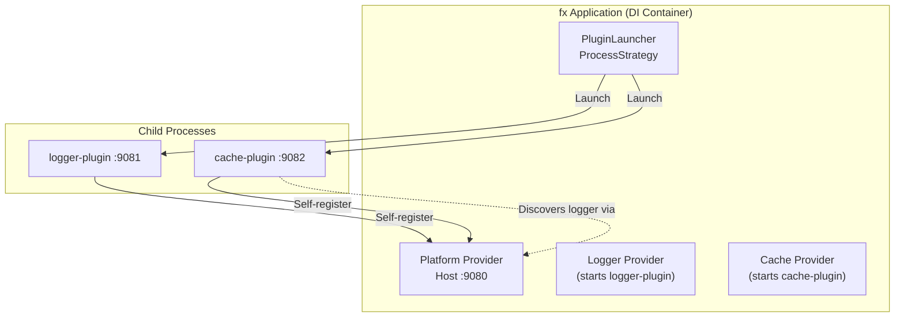

# fx-managed: Unmanaged Deployment with fx Orchestration

Demonstrates **unmanaged deployment** where **uber/fx** is the orchestrator instead of the platform.

## Architecture



## Key Concepts

### fx as Orchestrator

- **fx** manages the application lifecycle (not the platform)
- **PluginLauncher** starts plugin processes when fx needs them
- **Plugins** self-register with the host (unmanaged deployment)
- **Service Registry** handles plugin-to-plugin dependencies

### Two Dependency Graphs

**1. fx DI Graph:**
```
Platform → PluginLauncher → Logger Endpoint → Cache Endpoint
```
fx starts plugins based on DI dependencies.

**2. Service Registry Graph:**
```
Logger (provides: logger)
  ↑
Cache (requires: logger)
```
Plugins discover each other via Service Registry.

**They work together!**

## What This Demonstrates

1. **Unmanaged deployment** - fx orchestrates, not Platform.AddPlugin()
2. **PluginLauncher** - Maps service types to plugin binaries
3. **Pluggable strategies** - ProcessStrategy (could also use InMemoryStrategy)
4. **Multi-service plugins** - Single plugin can provide multiple services
5. **fx lifecycle integration** - Plugins start in OnStart, stop in OnStop

## Running the Example

### Prerequisites

Plugin binaries must be built:
```bash
task build-examples
```

This builds:
- `dist/logger-plugin`
- `dist/cache-plugin`

### Run

```bash
# From repository root
./dist/fx-managed
```

### Expected Output

```
=== fx-managed: Unmanaged Deployment with fx as Orchestrator ===

[Fx] PROVIDE ...
✓ Host platform started on :9080

=== Launching Plugins via fx ===
fx requesting Logger service...
Logger plugin started (Unmanaged) with runtime_id: logger-plugin-1134
Registered service: logger v1.0.0
✓ Logger available at: http://localhost:9081/services/logger/logger-plugin-1134

fx requesting Cache service...
Cache plugin started (Unmanaged) with runtime_id: cache-plugin-275e
Registered service: cache v1.0.0
Logger discovered, reporting healthy
✓ Cache available at: http://localhost:9082/services/cache/cache-plugin-275e

=== Plugin Status ===
✓ Logger plugin running (process strategy)
✓ Cache plugin running (process strategy)
✓ Both plugins registered with Service Registry
✓ Cache discovered logger via Service Registry

=== fx-managed demonstration complete! ===
  - fx orchestrated plugin startup (unmanaged deployment)
  - Plugins started as child processes
  - Plugins self-registered with host
  - PluginLauncher with ProcessStrategy
  - Service Registry handled plugin dependencies

Shutting down plugins...
```

## Code Walkthrough

### 1. Provide Host Platform

```go
fx.Provide(func() (*connectplugin.Platform, *connectplugin.ServiceRegistry) {
    // Create host platform components
    handshake := connectplugin.NewHandshakeServer(...)
    lifecycle := connectplugin.NewLifecycleServer()
    registry := connectplugin.NewServiceRegistry(lifecycle)
    router := connectplugin.NewServiceRouter(...)
    platform := connectplugin.NewPlatform(registry, lifecycle, router)

    return platform, registry
})
```

### 2. Provide PluginLauncher

```go
fx.Provide(func(platform *Platform, registry *ServiceRegistry) *PluginLauncher {
    launcher := connectplugin.NewPluginLauncher(platform, registry)

    // Register strategy
    launcher.RegisterStrategy(connectplugin.NewProcessStrategy())

    // Configure plugins
    launcher.Configure(map[string]connectplugin.PluginSpec{
        "logger-plugin": {
            Name:       "logger-plugin",
            Provides:   []string{"logger"},
            Strategy:   "process",
            BinaryPath: "./dist/logger-plugin",
            HostURL:    "http://localhost:9080",
            Port:       9081,
        },
        "cache-plugin": {
            Name:       "cache-plugin",
            Provides:   []string{"cache"},
            Strategy:   "process",
            BinaryPath: "./dist/cache-plugin",
            HostURL:    "http://localhost:9080",
            Port:       9082,
        },
    })

    return launcher
})
```

### 3. Start Host Server

```go
fx.Invoke(func(lc fx.Lifecycle, platform *Platform, registry *ServiceRegistry) {
    lc.Append(fx.Hook{
        OnStart: func(ctx context.Context) error {
            // Create HTTP server with Service Registry endpoints
            mux := http.NewServeMux()
            mux.Handle(..., handshakeHandler)
            mux.Handle(..., lifecycleHandler)
            mux.Handle(..., registryHandler)
            mux.Handle("/services/", router)

            server := &http.Server{Addr: ":9080", Handler: mux}
            go server.ListenAndServe()

            return nil
        },
    })
})
```

### 4. Launch Plugins

```go
fx.Invoke(func(lc fx.Lifecycle, launcher *PluginLauncher) {
    lc.Append(fx.Hook{
        OnStart: func(ctx context.Context) error {
            // fx requests logger → launcher starts logger-plugin
            loggerEndpoint, _ := launcher.GetService("logger-plugin", "logger")

            // fx requests cache → launcher starts cache-plugin
            cacheEndpoint, _ := launcher.GetService("cache-plugin", "cache")

            // Both plugins now running and registered
            return nil
        },
    })
})
```

### 5. Cleanup

```go
fx.Invoke(func(lc fx.Lifecycle, launcher *PluginLauncher) {
    lc.Append(fx.Hook{
        OnStop: func(ctx context.Context) error {
            launcher.Shutdown()  // Kills all plugin processes
            return nil
        },
    })
})
```

## PluginLauncher Design

### Pluggable Strategies

```go
// Register multiple strategies
launcher.RegisterStrategy(NewProcessStrategy())
launcher.RegisterStrategy(NewInMemoryStrategy())

// Each plugin specifies its strategy
PluginSpec{
    Strategy: "process",    // or "in-memory"
}
```

### Multi-Service Plugins

```go
// Single plugin provides multiple services
PluginSpec{
    Name:     "data-plugin",
    Provides: []string{"cache", "storage", "metrics"},  // ← Multiple!
    Strategy: "process",
}

// Get different services from same plugin
cacheEndpoint, _ := launcher.GetService("data-plugin", "cache")
storageEndpoint, _ := launcher.GetService("data-plugin", "storage")
// data-plugin starts ONCE, provides BOTH services
```

### Process Reuse

```go
// First call: launches process
launcher.GetService("data-plugin", "cache")
  → Starts data-plugin process
  → Waits for registration
  → Discovers cache service
  → Returns endpoint

// Second call: reuses process
launcher.GetService("data-plugin", "storage")
  → Plugin already running
  → Just discovers storage service
  → Returns endpoint
```

## Comparison to Other Deployment Models

| Aspect | fx-managed (This Example) | Docker Compose | Kubernetes Helm |
|--------|---------------------------|----------------|-----------------|
| **Orchestrator** | fx (in-process) | docker-compose | Kubernetes |
| **Deployment** | Unmanaged | Unmanaged | Unmanaged |
| **Plugin processes** | Child processes | Separate containers | Sidecar containers |
| **Communication** | localhost | Container network | Pod localhost |
| **Use case** | Single-binary app with plugins | Development, testing | Production K8s |

## When to Use This Pattern

**Good for:**
- Single-binary applications with plugin extensibility
- Development and testing
- When you need DI for plugin clients
- Monolithic apps transitioning to plugins

**Not ideal for:**
- Distributed deployments
- Container orchestration (use Compose/K8s instead)
- When plugins run on different hosts

## Next Steps

- Try InMemoryStrategy (change spec.Strategy to "in-memory")
- Add more plugins
- Create typed client wrappers for actual plugin calls
- See [Docker Compose Guide](../../docs/guides/docker-compose.md) for container deployment
- See [Kubernetes Guide](../../docs/guides/kubernetes.md) for K8s deployment
